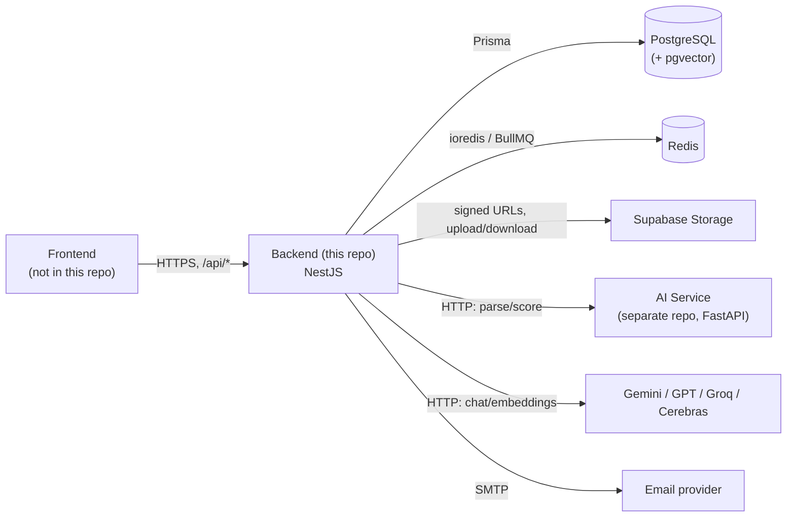
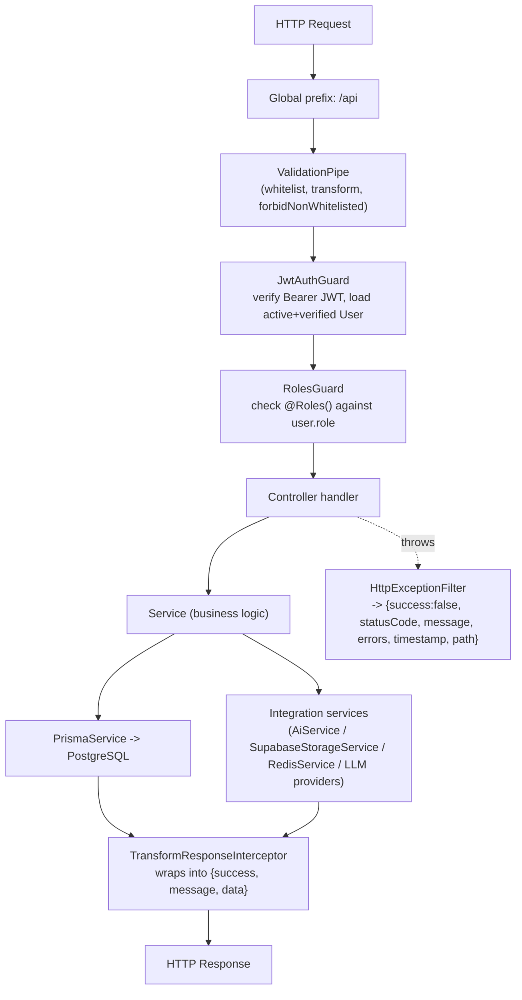
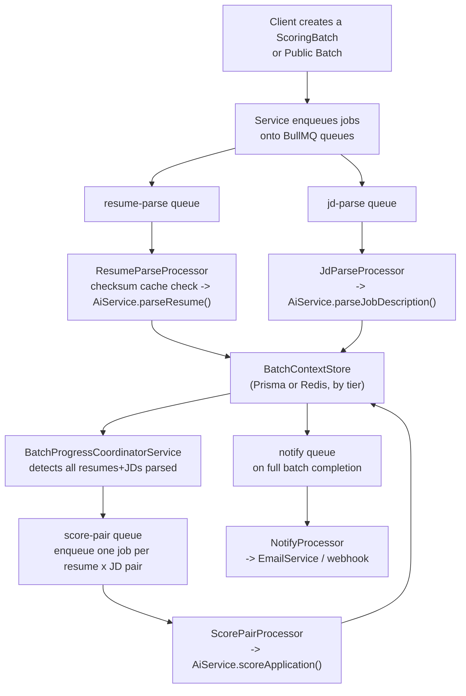
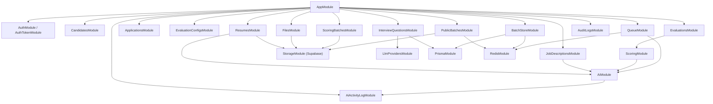
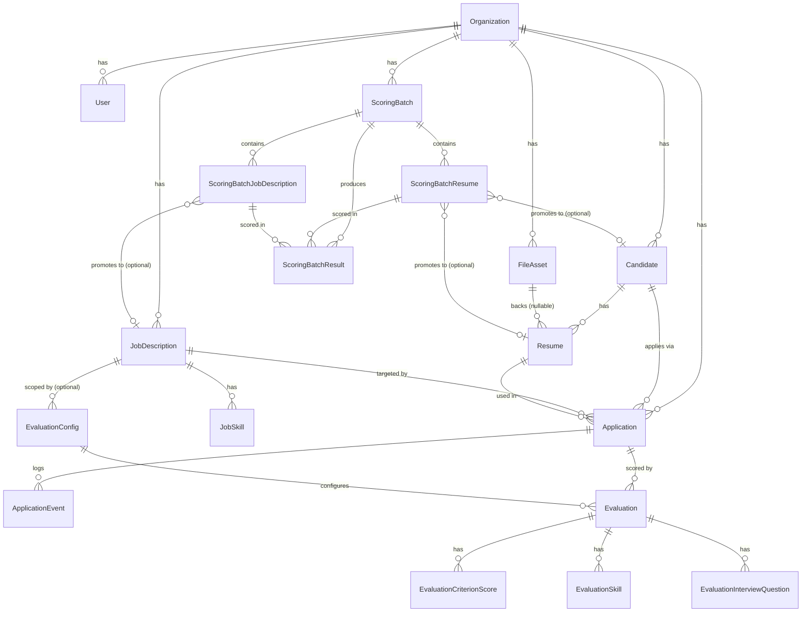

# AI Recruiter Mini — Backend

---

## Overview

**AI Recruiter Mini Backend** is the central API and orchestration layer of the AI Recruiter Mini recruitment screening platform. It is a **NestJS 11** application backed by **PostgreSQL** (via **Prisma 7**), **Redis** (via **ioredis** and **BullMQ**), and **Supabase Storage**, and it is the only service the Frontend talks to — it in turn calls a separate, internal **AI Service** (a Python/FastAPI application, not part of this repository) for resume/job-description parsing and CV–JD scoring.

The business problem this backend solves is **recruitment screening automation for organizations (multi-tenant)**: recruiters upload/paste resumes and job descriptions, the system extracts structured data from them via the AI service, matches candidates against job requirements with an explainable, criteria-weighted score, and surfaces matched/missing skills plus auto-generated interview questions — all scoped per-organization with role-based access control.

Two distinct usage tiers are implemented in code:

- **Enterprise tier** — authenticated organizations (JWT + role-based access) managing candidates, resumes, job descriptions, applications, evaluations, and durable "scoring batches" (bulk CV × JD matrix scoring), all persisted in PostgreSQL.
- **Public tier** — small, ephemeral, unauthenticated "public batches" (`/public/batches`) identified by an anonymous session header, backed by Redis instead of Postgres, intended for low-volume, no-signup try-it-out scoring.

Target users, inferred from the `UserRole` enum and route guards, are `ADMIN`, `RECRUITER`, and `HIRING_MANAGER` users within an organization, plus a cross-cutting `DEV` role that manages a shared interview-question knowledge base independent of any single organization.

---

## Features

- **Multi-tenant organization/user model** with email-verified registration, JWT login, password reset, and role-based access control (`ADMIN`, `RECRUITER`, `HIRING_MANAGER`, `DEV`).
- **Candidate & resume management** — create candidates, upload/parse resumes (PDF/DOCX via Supabase signed URLs, or raw pasted text), track parse status.
- **Job description management** — create/parse job descriptions, manage structured `JobSkill` records, auto-classify JDs into an occupation taxonomy.
- **Application tracking** — link a candidate + resume + job description into an `Application` with a status lifecycle (`DRAFT` → … → `HIRED`/`REJECTED`/`WITHDRAWN`) and an append-only `ApplicationEvent` audit trail.
- **Configurable, explainable evaluation/scoring** — `EvaluationConfig` defines weighted criteria (`SKILLS_MATCH`, `EXPERIENCE_RELEVANCE`, `PROJECT_RELEVANCE`, `EDUCATION_CERTIFICATION`, `KEYWORD_DOMAIN_ALIGNMENT`); `Evaluation` stores the resulting per-criterion scores, matched/missing skills, evidence, and generated interview questions, retrievable via dedicated breakdown/skills/evidence/interview-question endpoints, with retry support.
- **Bulk "scoring batches"** — score N resumes against M job descriptions as an async matrix, backed by BullMQ queues, with progress tracking, a matrix/cell/export API, cancellation, and "promotion" of batch items into durable Candidate/Resume/JobDescription/Application/Evaluation records.
- **Public (anonymous) batch scoring** — a small-scale, ephemeral, Redis-backed variant of scoring batches for unauthenticated use, gated by per-anonymous-session and IP rate limits with a TTL-based auto-expiry.
- **Async processing via BullMQ** — dedicated queues for resume parsing, JD parsing, CV–JD scoring, and notifications, each with configurable concurrency, retry/backoff, and a Bull Board dashboard.
- **Interview question knowledge base** — a `DEV`-only module (`InterviewQuestionEntry`) with Gemini-embedding-backed (`pgvector`) semantic search plus taxonomy filters, and AI-fallback generation (via pooled GPT/Groq/Cerebras providers) when a search returns too few results.
- **Multi-provider LLM integration** with per-provider API key pools (up to 4 keys each for Gemini, GPT, Groq, Cerebras), round-robin key rotation, cross-provider fallback, and mid-generation continuation for truncated completions.
- **File management** — upload/download/delete resume and JD files through Supabase Storage, with checksum-based dedupe support.
- **AI activity logging** — every call to the external AI service (parse resume/JD, score application) is timed and logged (`AiActivityLog`) with input/output for observability, across both enterprise and public tiers.
- **Organization-scoped audit logging** — opt-in, decorator-driven (`@AuditLog()`) logging of sensitive mutations.
- **Standardized API contract** — every response is wrapped in a `{ success, message, data }` envelope (or a structured error envelope) by a global interceptor and exception filter.
- **Swagger/OpenAPI docs** auto-generated and served at `/docs` in non-production environments.
- **Bull Board** queue-monitoring dashboard mounted alongside the API.

---

## Architecture

### High-level



### NestJS module architecture

The application is composed of NestJS feature modules wired together in `src/app.module.ts`:

- **Global config module** (`ConfigModule.forRoot`, `isGlobal: true`) loading typed config namespaces (`app`, `database`, `supabase`, `redis`, `email`, `queue`, `llmProviders`) and validating all environment variables with a single Joi schema.
- **Infrastructure/integration modules**: `PrismaModule`, `StorageModule` (Supabase), `RedisModule`, `EmailModule`, `AiModule` (AI service HTTP client), `LlmProvidersModule` (Gemini/GPT/Groq/Cerebras).
- **Domain feature modules**: `HealthModule`, `AuthModule`/`AuthTokenModule`, `UsersModule`, `FilesModule`, `CandidatesModule`, `ResumesModule`, `JobDescriptionsModule`, `ApplicationsModule`, `InterviewQuestionsModule`, `EvaluationConfigsModule`, `EvaluationsModule` (+ nested `ScoringModule`), `ScoringBatchesModule`, `PublicBatchesModule`, `AuditLogsModule`, `AiActivityLogModule`.
- **Queue infrastructure**: `QueueModule` (BullMQ registration + processors) and `BatchStoreModule` (an abstraction that resolves to either a Prisma-backed or Redis-backed batch context store depending on tier).
- **Middleware**: `AnonymousSessionMiddleware` is applied only to `public/batches` routes, stamping/echoing an `x-anon-session-id` header.

### Layered architecture (per module)

Each domain module generally follows: **Controller** (HTTP routing, guards, DTO validation) → **Service** (business logic, Prisma calls, calls to integrations) → **PrismaService** (database access) / **integration services** (AI service, Supabase, Redis, LLM providers). Some modules add a dedicated mapper (e.g. `resume-structured.mapper.ts`, `job-description-structured.mapper.ts`) or a classifier service (`job-description-classifier.service.ts`) between the controller and persistence layer.

### Request Flow

**Typical authenticated CRUD/business request:**



**Async resume/JD parsing + scoring (batch pipeline):**



### Module Dependency (selected)



---

## Technology Stack

| Category | Technology | Version (package.json) |
|---|---|---|
| Language | TypeScript | ^5.7.3 |
| Framework | NestJS (`@nestjs/common`, `@nestjs/core`) | ^11.0.1 |
| HTTP platform | `@nestjs/platform-express` | ^11.1.19 |
| ORM | Prisma (`@prisma/client`, `prisma`) + `@prisma/adapter-pg` | ^7.7.0 / ^7.8.0 |
| Database | PostgreSQL (via `pg`), with a `vector(768)` column for embeddings (pgvector) | `pg` ^8.20.0 |
| Cache / queue backing store | Redis via `ioredis` | ^5.10.1 |
| Job queues | BullMQ (`bullmq`, `@nestjs/bullmq`) | ^5.80.2 / ^11.0.4 |
| Queue dashboard | Bull Board (`@bull-board/api`, `@bull-board/express`) | ^8.1.2 |
| Object storage | Supabase Storage (`@supabase/supabase-js`) | ^2.104.1 |
| HTTP client (outbound) | `@nestjs/axios` + `axios` | ^4.0.1 / ^1.15.2 |
| Validation | `class-validator`, `class-transformer` | ^0.15.1 / ^0.5.1 |
| Env validation | `joi` | ^18.1.2 |
| Auth | Custom JWT signing/verification (`src/common/utils/jwt.util.ts`) — **not found**: Passport.js or `@nestjs/jwt` | — |
| Email | `nodemailer` (SMTP) | ^9.0.3 |
| API docs | `@nestjs/swagger` + `swagger-ui-express` | ^11.3.2 / ^5.0.1 |
| File uploads | `multer` | ^2.1.1 |
| IDs | `uuid` | ^14.0.0 |
| Testing | Jest, `ts-jest`, `supertest` | ^30.0.0 / ^29.2.5 / ^7.0.0 |
| Linting/formatting | ESLint (flat config) + Prettier | ^9.39.4 / ^3.8.3 |
| Containerization | Docker, multi-stage, `node:22-alpine` | — |
| CI/CD | GitHub Actions → GitHub Container Registry | — |

**External AI providers wired via `llm-providers.config.ts`:** Google Gemini (chat completion key pool **and** a separate embedding client), OpenAI GPT (`gpt-4o-mini` default), Groq (`llama-3.3-70b-versatile` default), Cerebras (`gpt-oss-120b` default) — all OpenAI-compatible chat endpoints except Gemini's dedicated embedding client.

**Not found in the repository:** GraphQL, WebSockets, message brokers other than Redis/BullMQ, and any authentication library (Passport/OAuth) — JWT issuance/verification is hand-rolled.

---

## Folder Structure

```text
.
├── src/
│   ├── main.ts                          # Bootstrap: global prefix, CORS, pipes, filters, interceptors, Swagger, Bull Board
│   ├── app.module.ts                    # Root module — wires config + all feature/integration modules
│   ├── common/
│   │   ├── constants/                   # Default evaluation criteria, interview-question taxonomy, assignable roles, upload limits
│   │   ├── decorators/                  # @Roles, @RateLimit, @AuditLog, @CurrentUser, @CurrentAnonymousSession
│   │   ├── dto/                         # ApiResponseDto (shared response shape)
│   │   ├── enums/                       # ApplicationStatus, EvaluationStatus, FileAssetStatus, ParseStatus, ResumeFileType
│   │   ├── exceptions/                  # AppException (uniform HTTP exception with status code)
│   │   ├── filters/                     # HttpExceptionFilter (global)
│   │   ├── guards/                      # JwtAuthGuard, RolesGuard, EmailRateLimitGuard, EnterpriseRateLimitGuard, PublicRateLimitGuard
│   │   ├── interceptors/                # TransformResponseInterceptor, AuditLogInterceptor
│   │   ├── middleware/                  # AnonymousSessionMiddleware
│   │   ├── types/                       # AiService types, AuthUser, ApiResponse, upload-file types
│   │   └── utils/                       # checksum, entity-exists, jwt, password, pii-redaction, token, upload-file helpers
│   ├── config/                          # Typed config-namespace loaders + Joi env validation schema
│   ├── database/prisma/                 # PrismaModule + PrismaService (Prisma Client wrapper)
│   ├── integrations/
│   │   ├── ai/                          # AiService — HTTP client for the external AI (FastAPI) service
│   │   ├── email/                       # EmailService (nodemailer) + email templates
│   │   ├── llm-providers/               # GeminiEmbeddingService, MultiProviderCompletionService, KeyRotator
│   │   ├── redis/                       # RedisService (ioredis wrapper)
│   │   └── storage/                     # SupabaseStorageService
│   ├── modules/                         # One folder per domain feature (see Module Overview below)
│   └── queue/
│       ├── batch-store/                 # BatchContextStoreFactory + Prisma/Redis-backed store implementations
│       ├── processors/                  # ResumeParseProcessor, JdParseProcessor, ScorePairProcessor, NotifyProcessor
│       ├── jobs/                        # Job payload type definitions
│       ├── batch-progress-coordinator.service.ts
│       ├── bull-board.setup.ts          # Mounts the Bull Board dashboard
│       ├── queue.constants.ts           # Queue name constants + BatchTier type
│       └── queue.module.ts              # BullMQ registration + processor providers
├── prisma/
│   ├── schema.prisma                    # Full data model (see Database section)
│   └── migrations/                      # 13 timestamped SQL migrations (init through AI activity log)
├── docs/                                # API contract, auth API, applications, evaluations, job-descriptions, configuration docs
├── test/                                # E2E test scaffold (app.e2e-spec.ts, jest-e2e.json)
├── Dockerfile                           # Multi-stage production image
├── .github/workflows/docker-publish.yml # CI: build & publish image to GHCR on push to main
├── nest-cli.json / tsconfig*.json       # Nest CLI + TypeScript project config
├── eslint.config.mjs / .prettierrc      # Linting/formatting config
└── package.json                         # Scripts & dependencies
```

---

## System Architecture Diagram

See [Architecture → High-level](#high-level) above for the system-context diagram (Frontend → Backend → PostgreSQL/Redis/Supabase/AI Service/LLM providers/SMTP).

---

## Request Flow Diagram

See [Architecture → Request Flow](#request-flow) above for both the standard authenticated-request flow and the async batch parsing/scoring pipeline.

---

## Module Overview

| Module | Purpose | Controller(s) | Key service(s) | Notable entities |
|---|---|---|---|---|
| `HealthModule` | Liveness endpoint | `HealthController` | `HealthService` | — |
| `AuthModule` / `AuthTokenModule` | Registration, login, email verification, password reset | `AuthController` | `AuthService`, `AuthTokenService` | `User`, `Organization`, `AuthToken` |
| `UsersModule` | Org-scoped user management | `UsersController` | `UsersService` | `User` |
| `FilesModule` | Upload/download/delete files in Supabase Storage | `FilesController` | `FilesService` | `FileAsset` |
| `CandidatesModule` | Candidate CRUD, list resumes for a candidate | `CandidatesController` | `CandidatesService` | `Candidate` |
| `ResumesModule` | Resume upload, parse (via AI service), fetch parsed data | `ResumesController` | `ResumesService` | `Resume` |
| `JobDescriptionsModule` | JD CRUD, parse, occupation classification, `JobSkill` sub-resource | `JobDescriptionsController`, `JobSkillsController` | `JobDescriptionsService`, `JobSkillsService`, `JobDescriptionClassifierService` | `JobDescription`, `JobSkill` |
| `ApplicationsModule` | Link candidate + resume + JD; status lifecycle; event log | `ApplicationsController` | `ApplicationsService` | `Application`, `ApplicationEvent` |
| `EvaluationConfigsModule` | Define/weight scoring criteria sets | `EvaluationConfigsController` | `EvaluationConfigsService` | `EvaluationConfig` |
| `EvaluationsModule` + `ScoringModule` | Run/retrieve scoring for an application; breakdown/skills/evidence/interview-questions; retry | `EvaluationsController` | `EvaluationsService`, `ScoringService` | `Evaluation`, `EvaluationCriterionScore`, `EvaluationSkill`, `EvaluationInterviewQuestion` |
| `ScoringBatchesModule` | Enterprise bulk CV × JD matrix scoring; matrix/cell/export; promote to durable records | `ScoringBatchesController` | `ScoringBatchesService`, `ScoringBatchPromoteService` | `ScoringBatch`, `ScoringBatchResume`, `ScoringBatchJobDescription`, `ScoringBatchResult` |
| `PublicBatchesModule` | Anonymous, ephemeral, small-scale batch scoring (Redis-backed) | `PublicBatchesController` | `PublicBatchesService` | (Redis keys; no dedicated Prisma model) |
| `InterviewQuestionsModule` | `DEV`-only interview-question knowledge base with embedding search + AI fallback generation | `InterviewQuestionsController` | `InterviewQuestionsService`, `InterviewQuestionGeneratorService` | `InterviewQuestionEntry` |
| `AiActivityLogModule` | `DEV`-only observability over every AI-service call | `AiActivityLogController` | `AiActivityLogService`, `AiActivityLogLoggerService` | `AiActivityLog` |
| `AuditLogsModule` | `ADMIN`-only view of opt-in audited mutations | `AuditLogsController` | `AuditLogsService` | `AuditLog` |
| `QueueModule` / `BatchStoreModule` | BullMQ queue registration, processors, and tier-aware batch context storage | — | 4 processors + `BatchProgressCoordinatorService` | — |
| `AiModule` (integration) | HTTP client to the external AI service | — | `AiService` | — |
| `LlmProvidersModule` (integration) | Gemini embeddings + pooled GPT/Groq/Cerebras completions | — | `GeminiEmbeddingService`, `MultiProviderCompletionService` | — |
| `StorageModule` (integration) | Supabase Storage wrapper | — | `SupabaseStorageService` | — |
| `RedisModule` (integration) | Shared ioredis client | — | `RedisService` | — |
| `EmailModule` (integration) | SMTP email sending + templates | — | `EmailService` | — |

---

## Installation

### Prerequisites

- **Node.js** — version not pinned in `package.json`'s `engines` field (**not found**); the Docker image uses `node:22-alpine`, so Node 22 is the verified runtime.
- **npm** (repo ships `package-lock.json`)
- **PostgreSQL** with the `pgvector` extension available (required by `InterviewQuestionEntry.embedding Unsupported("vector(768)")`)
- **Redis**
- A **Supabase** project (Storage buckets)
- The companion **AI Service** running and reachable (see `AI_SERVICE_URL`)

### Setup

```bash
git clone https://github.com/DangHuuLong/Ai-Recruiter-Mini-Backend.git
cd Ai-Recruiter-Mini-Backend

npm ci

cp .env.example .env
# fill in DATABASE_URL, SUPABASE_URL, SUPABASE_SERVICE_ROLE_KEY, REDIS_URL, JWT_SECRET, etc.

npx prisma generate
npx prisma migrate deploy   # or `prisma migrate dev` in a local dev database
```

---

## Environment Variables

All variables are validated at bootstrap by a single Joi schema (`src/config/env.validation.ts`) and mirrored in `.env.example`.

| Variable | Purpose | Required | Default |
|---|---|---|---|
| `NODE_ENV` | `development` \| `test` \| `production` | No | `development` |
| `PORT` | HTTP port the server listens on | No | `3000` |
| `DATABASE_URL` | PostgreSQL connection string (Prisma) | **Yes** | — |
| `DIRECT_URL` | Optional direct (non-pooled) PostgreSQL URL | No | — |
| `SUPABASE_URL` | Supabase project URL | **Yes** | — |
| `SUPABASE_SERVICE_ROLE_KEY` | Supabase service-role key (server-side storage access) | **Yes** | — |
| `SUPABASE_BUCKET` | Bucket for enterprise (durable) file uploads | No | `cv-files` |
| `SUPABASE_PUBLIC_TEMP_BUCKET` | Separate bucket for public/anonymous batch uploads (must be created manually in Supabase, per code comment, so a bucket-level lifecycle rule can independently expire files) | No | `file-public` |
| `REDIS_URL` | Redis connection string (BullMQ + RedisService) | **Yes** | — |
| `GEMINI_API_KEY` | Legacy/singular Gemini key field (present in schema) | No | — |
| `GEMINI_MODEL` | Gemini chat model name | No | `gemini-3-flash-preview` |
| `MAX_FILE_SIZE_MB` | Max upload size enforced by file-upload validation | No | `5` |
| `AI_SERVICE_URL` | Base URL of the external AI (FastAPI) service | No | `http://localhost:8000` |
| `AI_REQUEST_TIMEOUT_MS` | Timeout for calls to the AI service | No | `30000` |
| `USE_MOCK_AI` | Present in `.env.example`; **not found** referenced in the Joi schema or inspected source — appears unused/vestigial | No | `true` |
| `JWT_SECRET` | Secret used to sign/verify session JWTs (min 16 chars) | **Yes** | — |
| `JWT_EXPIRES_IN_SECONDS` | JWT lifetime | No | `86400` |
| `SMTP_HOST` / `SMTP_PORT` / `SMTP_USER` / `SMTP_PASSWORD` | SMTP transport config; if unset, `EmailService` logs and no-ops (per code comment) | No | — |
| `EMAIL_FROM` | From-address for outgoing email | No | — |
| `FRONTEND_URL` | Used to build links in verification/reset emails | No | `http://localhost:3001` |
| `EMAIL_VERIFICATION_TOKEN_TTL_SECONDS` | Email verification token lifetime | No | `86400` |
| `PASSWORD_RESET_TOKEN_TTL_SECONDS` | Password reset token lifetime | No | `3600` |
| `AI_PARSE_RESUME_CONCURRENCY` | BullMQ worker concurrency for the resume-parse queue | No | `8` |
| `AI_PARSE_JD_CONCURRENCY` | BullMQ worker concurrency for the jd-parse queue | No | `8` |
| `AI_SCORE_CONCURRENCY` | BullMQ worker concurrency for the score-pair queue (deliberately low — the AI service's ML blend, not backend concurrency, is the bottleneck per code comment) | No | `4` |
| `ENTERPRISE_MAX_FILES_PER_BATCH` | Max resumes per enterprise scoring batch | No | `2000` |
| `ENTERPRISE_MAX_JDS_PER_BATCH` | Max JDs per enterprise scoring batch | No | `50` |
| `PUBLIC_MAX_FILES_PER_BATCH` | Max resumes per public (anonymous) batch | No | `2` |
| `PUBLIC_MAX_JDS_PER_BATCH` | Max JDs per public batch | No | `10` |
| `PUBLIC_BATCH_TTL_SECONDS` | Redis TTL for public batch data | No | `21600` |
| `PUBLIC_RATE_LIMIT_MAX_BATCHES_PER_HOUR` | Rate limit for public batch creation | No | `5` |
| `ENTERPRISE_RATE_LIMIT_MAX_BATCHES_PER_HOUR` | Rate limit for enterprise batch creation | No | `20` |
| `ENTERPRISE_RATE_LIMIT_MAX_QUESTION_SEARCHES_PER_HOUR` | Rate limit for interview-question `search-or-generate` | No | `100` |
| `AUTH_RATE_LIMIT_MAX_RESEND_VERIFICATION_PER_HOUR` | Rate limit for resending verification emails | No | `3` |
| `AUTH_RATE_LIMIT_MAX_FORGOT_PASSWORD_PER_HOUR` | Rate limit for forgot-password requests | No | `3` |
| `GEMINI_API_KEY_1..4` | Pooled Gemini API keys (chat + embeddings), rotated round-robin | No | — |
| `GEMINI_EMBEDDING_MODEL` | Gemini embedding model (768-dim, matches `pgvector` column) | No | `gemini-embedding-001` |
| `GPT_API_KEY_1..4` | Pooled OpenAI API keys | No | — |
| `GPT_MODEL` | OpenAI chat model | No | `gpt-4o-mini` |
| `GROQ_API_KEY_1..4` | Pooled Groq API keys | No | — |
| `GROQ_MODEL` | Groq chat model | No | `llama-3.3-70b-versatile` |
| `CEREBRAS_API_KEY_1..4` | Pooled Cerebras API keys | No | — |
| `CEREBRAS_MODEL` | Cerebras chat model | No | `gpt-oss-120b` |
| `INTERVIEW_QUESTION_SIMILARITY_THRESHOLD` | Minimum cosine-similarity for an existing question to count as a match in semantic search | No | `0.55` |
| `INTERVIEW_QUESTION_FALLBACK_GENERATE_COUNT` | How many questions to AI-generate when search results are thin | No | `5` |

Each provider's keys are collected via a shared helper (`collectKeys`) that reads `${PREFIX}_1..4`, filters out unset values, and skips a provider entirely if it ends up with zero keys.

---

## Running Locally

```bash
npm run start:dev      # nest start --watch (hot reload)
# or
npm run start          # nest start
# or, after building:
npm run build && npm run start:prod   # node dist/src/main
```

The API is served under the global prefix `/api` (e.g. `http://localhost:3000/api/health`). In any non-`production` `NODE_ENV`, Swagger UI is available at `/docs`, and Bull Board (queue dashboard) is mounted by `setupBullBoard(app)` in `main.ts`.

### Other scripts

| Script | Command | Purpose |
|---|---|---|
| `build` | `nest build` | Compile TypeScript to `dist/` |
| `format` | `prettier --write "src/**/*.ts" "test/**/*.ts"` | Auto-format source |
| `format:check` | `prettier --check ...` | CI-style format check |
| `lint` | `eslint "{src,apps,libs,test}/**/*.ts" --fix` | Lint and auto-fix |
| `test` | `jest` | Run unit tests |
| `test:watch` | `jest --watch` | Watch mode |
| `test:cov` | `jest --coverage` | Coverage report |
| `test:debug` | `node --inspect-brk ... jest --runInBand` | Debug tests |
| `test:e2e` | `jest --config ./test/jest-e2e.json` | Run E2E tests |

**Not found in `package.json`:** dedicated `migrate`/`seed` npm scripts — Prisma migrations are run directly via the `prisma` CLI (`npx prisma migrate dev`, `npx prisma migrate deploy`, `npx prisma generate`), and no seed script file was found in the repository.

---

## Running with Docker

```bash
docker build -t ai-recruiter-mini-backend .
docker run -p 3000:3000 --env-file .env ai-recruiter-mini-backend
```

Notes from the multi-stage `Dockerfile`:
- **`deps`** stage: `node:22-alpine`, installs dependencies with `npm ci`.
- **`builder`** stage: copies dependencies + full source, runs `npx prisma generate` and `npm run build`.
- **`runner`** stage: fresh `node:22-alpine`, installs only production dependencies (`npm ci --omit=dev`), copies the compiled `dist/`, the `prisma/` folder, and the generated `@prisma`/`.prisma` client artifacts; runs as a non-root `nestjs` user; exposes port `3000`.
- A `HEALTHCHECK` hits `GET /api/health` every 30s.
- **`docker-compose.yml`**: **not found in the repository** — Postgres, Redis, and Supabase are expected to be provisioned externally (e.g. managed services) and referenced via `DATABASE_URL` / `REDIS_URL` / `SUPABASE_*`.

---

## API Overview

Every endpoint below is prefixed with `/api` (set via `app.setGlobalPrefix('api')` in `main.ts`). Auth column reflects the guards actually applied in the controllers (`JwtAuthGuard` for "JWT", plus the specific `@Roles(...)` list; "Public" = no `JwtAuthGuard`).

### Health

| Method | Route | Purpose | Auth |
|---|---|---|---|
| `GET` | `/health` | Liveness/status check | Public |

### Auth (`/auth`)

| Method | Route | Purpose | Auth |
|---|---|---|---|
| `POST` | `/auth/register-organization` | Create an organization + its first admin user; sends verification email | Public |
| `POST` | `/auth/login` | Verify credentials, issue JWT | Public |
| `POST` | `/auth/verify-email` | Consume verification token, log the user in | Public |
| `POST` | `/auth/resend-verification` | Resend verification email | Public, `EmailRateLimitGuard` (per-email, hourly) |
| `POST` | `/auth/forgot-password` | Trigger password-reset email | Public, `EmailRateLimitGuard` |
| `POST` | `/auth/reset-password` | Consume reset token, set new password | Public |

### Users (`/users`)

| Method | Route | Purpose | Auth |
|---|---|---|---|
| `POST` | `/users` | Create a user in the caller's organization | JWT, `ADMIN` |
| `GET` | `/users` | List users in the organization | JWT, `ADMIN` |
| `GET` | `/users/me` | Get the current authenticated user | JWT (any role) |
| `PATCH` | `/users/:id` | Update a user | JWT, `ADMIN` |

### Files (`/files`)

| Method | Route | Purpose | Auth |
|---|---|---|---|
| `POST` | `/files/upload` | Upload a file to Supabase Storage | JWT, `ADMIN`/`RECRUITER` |
| `GET` | `/files/:id` | Get file asset metadata | JWT, `ADMIN`/`RECRUITER`/`HIRING_MANAGER` |
| `GET` | `/files/:id/download-url` | Get a signed download URL | JWT, `ADMIN`/`RECRUITER`/`HIRING_MANAGER` |
| `DELETE` | `/files/:id` | Delete a file asset | JWT, `ADMIN`/`RECRUITER` |

### Candidates (`/candidates`)

| Method | Route | Purpose | Auth |
|---|---|---|---|
| `POST` | `/candidates` | Create a candidate | JWT, `ADMIN`/`RECRUITER` |
| `POST` | `/candidates/bulk-delete` | Bulk delete candidates | JWT, `ADMIN`/`RECRUITER` |
| `PATCH` | `/candidates/:id` | Update a candidate | JWT, `ADMIN`/`RECRUITER` |
| `GET` | `/candidates` | List/search candidates | JWT, `ADMIN`/`RECRUITER`/`HIRING_MANAGER` |
| `GET` | `/candidates/:id` | Get a candidate | JWT, `ADMIN`/`RECRUITER`/`HIRING_MANAGER` |
| `GET` | `/candidates/:id/resumes` | List a candidate's resumes | JWT, `ADMIN`/`RECRUITER`/`HIRING_MANAGER` |
| `DELETE` | `/candidates/:id` | Delete a candidate | JWT, `ADMIN`/`RECRUITER` |

### Resumes (`/resumes`)

| Method | Route | Purpose | Auth |
|---|---|---|---|
| `POST` | `/resumes` | Create/register a resume (file or raw text) | JWT, `ADMIN`/`RECRUITER` |
| `GET` | `/resumes` | List resumes | JWT, `ADMIN`/`RECRUITER`/`HIRING_MANAGER` |
| `GET` | `/resumes/:id` | Get a resume | JWT, `ADMIN`/`RECRUITER`/`HIRING_MANAGER` |
| `POST` | `/resumes/:id/parse` | Trigger AI parsing of a resume | JWT, `ADMIN`/`RECRUITER` |
| `GET` | `/resumes/:id/parsed-data` | Get parsed resume data | JWT, `ADMIN`/`RECRUITER`/`HIRING_MANAGER` |
| `PATCH` | `/resumes/:id` | Update a resume | JWT, `ADMIN`/`RECRUITER` |
| `DELETE` | `/resumes/:id` | Delete a resume | JWT, `ADMIN`/`RECRUITER` |

### Job Descriptions (`/job-descriptions`, `/job-skills`)

| Method | Route | Purpose | Auth |
|---|---|---|---|
| `POST` | `/job-descriptions` | Create a JD | JWT, `ADMIN`/`RECRUITER` |
| `POST` | `/job-descriptions/bulk-deactivate` | Bulk-deactivate JDs | JWT, `ADMIN`/`RECRUITER` |
| `GET` | `/job-descriptions` | List JDs | JWT, `ADMIN`/`RECRUITER`/`HIRING_MANAGER` |
| `GET` | `/job-descriptions/:id` | Get a JD | JWT, `ADMIN`/`RECRUITER`/`HIRING_MANAGER` |
| `POST` | `/job-descriptions/:id/parse` | Trigger AI parsing of a JD | JWT, `ADMIN`/`RECRUITER` |
| `GET` | `/job-descriptions/:id/parsed-data` | Get parsed JD data | JWT, `ADMIN`/`RECRUITER`/`HIRING_MANAGER` |
| `PATCH` | `/job-descriptions/:id` | Update a JD | JWT, `ADMIN`/`RECRUITER` |
| `DELETE` | `/job-descriptions/:id` | Delete a JD | JWT, `ADMIN`/`RECRUITER` |
| `GET` | `/job-descriptions/:id/skills` | List a JD's skills | JWT, `ADMIN`/`RECRUITER`/`HIRING_MANAGER` |
| `POST` | `/job-descriptions/:id/skills` | Add a skill to a JD | JWT, `ADMIN`/`RECRUITER` |
| `PATCH` | `/job-skills/:skillId` | Update a job skill | JWT, `ADMIN`/`RECRUITER` |
| `DELETE` | `/job-skills/:skillId` | Delete a job skill | JWT, `ADMIN`/`RECRUITER` |

### Applications

| Method | Route | Purpose | Auth |
|---|---|---|---|
| `POST` | `/applications` | Create an application (candidate + resume + JD) | JWT, `ADMIN`/`RECRUITER` |
| `GET` | `/applications` | List applications | JWT, `ADMIN`/`RECRUITER`/`HIRING_MANAGER` |
| `GET` | `/applications/:id` | Get an application | JWT, `ADMIN`/`RECRUITER`/`HIRING_MANAGER` |
| `PATCH` | `/applications/:id` | Update an application | JWT, `ADMIN`/`RECRUITER` |
| `PATCH` | `/applications/:id/status` | Change application status | JWT, `ADMIN`/`RECRUITER`/`HIRING_MANAGER` |
| `GET` | `/applications/:id/events` | List the application's event log | JWT, `ADMIN`/`RECRUITER`/`HIRING_MANAGER` |
| `GET` | `/candidates/:id/applications` | List a candidate's applications | JWT, `ADMIN`/`RECRUITER`/`HIRING_MANAGER` |

### Evaluation Configs (`/evaluation-configs`)

| Method | Route | Purpose | Auth |
|---|---|---|---|
| `POST` | `/evaluation-configs` | Create a scoring config | JWT, `ADMIN`/`RECRUITER` |
| `POST` | `/evaluation-configs/bulk-delete` | Bulk delete configs | JWT, `ADMIN`/`RECRUITER` |
| `GET` | `/evaluation-configs` | List configs | JWT, `ADMIN`/`RECRUITER`/`HIRING_MANAGER` |
| `GET` | `/evaluation-configs/:id` | Get a config | JWT, `ADMIN`/`RECRUITER`/`HIRING_MANAGER` |
| `PATCH` | `/evaluation-configs/:id` | Update a config | JWT, `ADMIN`/`RECRUITER` |
| `DELETE` | `/evaluation-configs/:id` | Delete a config | JWT, `ADMIN`/`RECRUITER` |

### Evaluations

| Method | Route | Purpose | Auth |
|---|---|---|---|
| `POST` | `/evaluations` | Run a new evaluation for an application | JWT, `ADMIN`/`RECRUITER` |
| `GET` | `/evaluations` | List evaluations | JWT, `ADMIN`/`RECRUITER`/`HIRING_MANAGER` |
| `GET` | `/evaluations/:id` | Get an evaluation | JWT, `ADMIN`/`RECRUITER`/`HIRING_MANAGER` |
| `GET` | `/applications/:id/evaluations` | List evaluations for an application | JWT, `ADMIN`/`RECRUITER`/`HIRING_MANAGER` |
| `GET` | `/evaluations/:id/breakdown` | Per-criterion score breakdown | JWT, `ADMIN`/`RECRUITER`/`HIRING_MANAGER` |
| `GET` | `/evaluations/:id/skills` | Matched/missing/related skills | JWT, `ADMIN`/`RECRUITER`/`HIRING_MANAGER` |
| `GET` | `/evaluations/:id/interview-questions` | Generated interview questions | JWT, `ADMIN`/`RECRUITER`/`HIRING_MANAGER` |
| `GET` | `/evaluations/:id/evidence` | Evidence map for the score | JWT, `ADMIN`/`RECRUITER`/`HIRING_MANAGER` |
| `POST` | `/evaluations/:id/retry` | Retry a failed evaluation | JWT, `ADMIN`/`RECRUITER` |

### Scoring Batches (`/scoring-batches`, enterprise tier)

| Method | Route | Purpose | Auth |
|---|---|---|---|
| `POST` | `/scoring-batches/upload-urls` | Get signed upload URLs for batch files | JWT, `ADMIN`/`RECRUITER` |
| `POST` | `/scoring-batches` | Create a scoring batch | JWT, `ADMIN`/`RECRUITER`, `EnterpriseRateLimitGuard` |
| `GET` | `/scoring-batches` | List batches | JWT, `ADMIN`/`RECRUITER` |
| `GET` | `/scoring-batches/:id` | Get a batch | JWT, `ADMIN`/`RECRUITER` |
| `GET` | `/scoring-batches/:id/matrix` | Get the CV × JD score matrix | JWT, `ADMIN`/`RECRUITER` |
| `GET` | `/scoring-batches/:id/cells/:resumeItemId/:jdItemId` | Get one matrix cell's detail | JWT, `ADMIN`/`RECRUITER` |
| `GET` | `/scoring-batches/:id/skill-gap-summary` | Aggregate skill-gap summary | JWT, `ADMIN`/`RECRUITER` |
| `GET` | `/scoring-batches/:id/export` | Export batch results | JWT, `ADMIN`/`RECRUITER` |
| `POST` | `/scoring-batches/:id/cancel` | Cancel a running batch | JWT, `ADMIN`/`RECRUITER` |
| `POST` | `/scoring-batches/:id/promote` | Promote batch items into durable Candidate/Resume/JD/Application/Evaluation records | JWT, `ADMIN`/`RECRUITER` |

### Public Batches (`/public/batches`, anonymous tier)

| Method | Route | Purpose | Auth |
|---|---|---|---|
| `POST` | `/public/batches/upload-urls` | Get signed upload URLs (public temp bucket) | Public (anonymous session) |
| `POST` | `/public/batches` | Create a public batch | Public, `PublicRateLimitGuard` |
| `GET` | `/public/batches/:id` | Get a public batch's status/results | Public (anonymous session) |

### Interview Questions (`/interview-questions`, `DEV`-only)

| Method | Route | Purpose | Auth |
|---|---|---|---|
| `POST` | `/interview-questions` | Create one question (embeds + persists) | JWT, `DEV` |
| `POST` | `/interview-questions/bulk` | Bulk create | JWT, `DEV` |
| `POST` | `/interview-questions/search` | Semantic + taxonomy search | JWT, `DEV` |
| `POST` | `/interview-questions/search-or-generate` | Search, falling back to AI generation on thin results | JWT, `DEV`, `EnterpriseRateLimitGuard` |
| `GET` | `/interview-questions` | List questions | JWT, `DEV` |
| `GET` | `/interview-questions/:id` | Get a question | JWT, `DEV` |
| `PATCH` | `/interview-questions/:id` | Update a question (re-embeds if text changed) | JWT, `DEV` |
| `POST` | `/interview-questions/:id/reembed` | Force re-embedding | JWT, `DEV` |
| `DELETE` | `/interview-questions/:id` | Delete a question | JWT, `DEV` |

### AI Activity Logs (`/ai-activity-logs`, `DEV`-only)

| Method | Route | Purpose | Auth |
|---|---|---|---|
| `GET` | `/ai-activity-logs/stats/summary` | Aggregate call stats | JWT, `DEV` |
| `GET` | `/ai-activity-logs/stats/timeseries` | Call stats over time | JWT, `DEV` |
| `GET` | `/ai-activity-logs` | List raw AI call logs | JWT, `DEV` |
| `GET` | `/ai-activity-logs/:id` | Get one AI call log | JWT, `DEV` |

### Audit Logs (`/audit-logs`, `ADMIN`-only)

| Method | Route | Purpose | Auth |
|---|---|---|---|
| `GET` | `/audit-logs` | List audit log entries | JWT, `ADMIN` |

Full request/response contracts for several of these areas are documented separately in `docs/api-contract.md`, `docs/auth-api.md`, `docs/applications.md`, `docs/evaluations.md`, `docs/evaluation-workflow.md`, and `docs/job-descriptions.md`.

---

## Authentication

- **Mechanism:** Hand-rolled JWT (`src/common/utils/jwt.util.ts`) — **not** Passport.js or `@nestjs/jwt` (neither appears in `package.json`).
- **Login flow:** `POST /auth/login` verifies the password hash (`src/common/utils/password.util.ts`) and issues a JWT signed with `JWT_SECRET`, expiring after `JWT_EXPIRES_IN_SECONDS`.
- **Request authentication:** `JwtAuthGuard` extracts a `Bearer <token>` from the `Authorization` header, verifies it, and loads the corresponding `User` from PostgreSQL, requiring `isActive: true` and a non-null `emailVerifiedAt` (otherwise `401`/`403`). The resolved `AuthUser` (id, organizationId, email, fullName, role) is attached to the request and made available to handlers via the `@CurrentUser()` decorator.
- **Authorization (RBAC):** `RolesGuard` reads a `@Roles(...UserRole[])` decorator (via `Reflector`) from the handler/class and rejects (`403`) any authenticated user whose `role` isn't in the allowed list. Route-by-route role requirements are listed in the [API Overview](#api-overview) above. Roles: `ADMIN`, `RECRUITER`, `HIRING_MANAGER`, `DEV` (`src/database` `UserRole` Prisma enum).
- **Email verification:** required before a JWT-authenticated request can succeed (`emailVerifiedAt` check in `JwtAuthGuard`); verification and resend/forgot/reset-password flows are all part of `AuthModule`.
- **Anonymous sessions:** For public/anonymous routes (`public/batches`), `AnonymousSessionMiddleware` issues (or echoes back) an `x-anon-session-id` header, used by `PublicRateLimitGuard` and the `@CurrentAnonymousSession()` decorator in place of a `User`. CORS explicitly exposes this header (`exposedHeaders: [ANON_SESSION_HEADER]`) since browsers otherwise strip custom response headers from `fetch()` by default.
- **Rate-limit guards:** `EmailRateLimitGuard` (keyed by target email, for unauthenticated auth routes), `EnterpriseRateLimitGuard` (keyed by organization, for authenticated bulk/heavy routes), `PublicRateLimitGuard` (keyed by anonymous session/IP) — all backed by Redis counters with hourly windows, configured via the `@RateLimit()` decorator + corresponding env var.
- **Not found:** OAuth/SSO, refresh tokens, session revocation/blacklist, or multi-factor authentication.

---

## Database

- **Engine:** PostgreSQL (Prisma `datasource db { provider = "postgresql" }`), with the `pgvector` extension used for one column (`InterviewQuestionEntry.embedding vector(768)`), accessed via raw SQL (`$queryRaw`/`$executeRaw`) since Prisma has no native vector type.
- **ORM:** Prisma 7 (`@prisma/client`, `@prisma/adapter-pg`), accessed through `PrismaService` (`src/database/prisma/prisma.service.ts`), wrapped by `PrismaModule`.
- **Migrations:** 13 timestamped SQL migrations under `prisma/migrations/`, from `00000000000000_init` through `20260803043019_add_ai_activity_log`, tracking the schema's evolution (scoring batches, batch text input, nullable-field promotion, interview-question ontology, dev role, knowledge-check question type, JD taxonomy fields, audit log, AI activity log).
- **Seed data:** **Not found in the repository** (no seed script/file located).
- **Transactions:** Used explicitly where multi-row consistency matters, e.g. `InterviewQuestionsService.create` wraps entry creation + embedding write in `prisma.$transaction`.

### Key entities and relationships

- **`Organization`** — multi-tenant root; owns `User`, `Candidate`, `JobDescription`, `Application`, `Evaluation`, `EvaluationConfig`, `FileAsset`, `ScoringBatch`, `AuditLog`, `AiActivityLog`.
- **`User`** — belongs to an `Organization`; has a `UserRole` (`ADMIN`/`RECRUITER`/`HIRING_MANAGER`/`DEV`); owns `AuthToken`s (email verification / password reset, storing only a SHA-256 hash of the raw token).
- **`FileAsset`** — an uploaded file (PDF/DOCX) in Supabase Storage, referenced by `Resume` and by `ScoringBatchResume`/`ScoringBatchJobDescription`.
- **`Candidate`** → has many `Resume`, `Application`; stores an aggregated `normalizedProfile` (JSON) across resumes.
- **`Resume`** — belongs to a `Candidate`; optionally references a `FileAsset` (nullable — a resume promoted from batch text input has no file); stores `rawText`, `parsedData` (JSON), `parseStatus`.
- **`JobDescription`** — belongs to an `Organization`; has many `JobSkill` (structured, source-of-truth skill records with `type` `REQUIRED`/`PREFERRED`); classified post-parse into an `occupationFamily`/`specialization` taxonomy.
- **`Application`** — join of `Candidate` + `JobDescription` + `Resume` (resume must belong to the candidate, enforced at the application layer, not the DB); has a `status` lifecycle and an `ApplicationEvent[]` audit trail.
- **`EvaluationConfig`** — a named, weighted `criteriaDefinition` (JSON array of `{criterion, weight}`), optionally scoped to one JD or used as an org default; `totalWeight` must equal `1.0` (enforced at the application layer).
- **`Evaluation`** — one scoring run of one `Application` against one `EvaluationConfig`; has many `EvaluationCriterionScore` (source of truth for `overallScore`, which is a computed cache), `EvaluationSkill`, `EvaluationInterviewQuestion`.
- **`ScoringBatch` family** (`ScoringBatch`, `ScoringBatchResume`, `ScoringBatchJobDescription`, `ScoringBatchResult`) — deliberately separate from the CRM pipeline above so exploratory bulk-scoring doesn't pollute Candidate/Resume/Application data until a recruiter explicitly "promotes" a batch item; `ScoringBatchResult` flattens criteria/skills/interview-questions into JSON columns (rather than normalized child rows) since batch cells are always read as a whole.
- **`InterviewQuestionEntry`** — the shared, cross-organization interview-question knowledge base with a taxonomy (`occupationFamily`, `specialization`, `competencyType`, `assessmentTarget`, `experienceBucket`, `autonomyLevel`, `questionType`) and a `vector(768)` embedding column for semantic search; separate from `EvaluationInterviewQuestion` (the questions actually shown for one evaluation).
- **`AuditLog`** — opt-in (`@AuditLog()` decorator + `AuditLogInterceptor`), not a global request log; records sensitive mutations only.
- **`AiActivityLog`** — one row per call to the external AI service (parse resume/JD, score application), across both tiers; deliberately has no foreign keys into business tables (public-tier batches have no such rows), only an optional `organizationId`.

### ER Diagram (core enterprise flow)



---

## AI Integration

This backend does **not** run any AI/ML model itself — all resume/JD parsing and CV–JD scoring is delegated to a **separate, internal AI (FastAPI) service** over HTTP, while a **second, independent LLM integration** in this repo handles interview-question generation and embeddings directly against third-party LLM providers.

### 1. AI Service integration (parsing & scoring)

- **Client:** `AiService` (`src/integrations/ai/ai.service.ts`), an injectable wrapper around `HttpService`/axios pointed at `AI_SERVICE_URL`.
- **Endpoints called:** `GET /health`, `POST /parse/resume`, `POST /parse/job-description`, `POST /score/application` — all unwrapped from the AI service's `{success, message, data}` envelope, with FastAPI-style `detail` validation errors flattened into a single message on failure.
- **Callers:** `ResumeParseProcessor` and `resumes.service.ts` call `parseResume`; `JdParseProcessor` and `job-descriptions.service.ts` call `parseJobDescription`; `ScorePairProcessor`, `ScoringService`, and `evaluations.service.ts` call `scoreApplication`.
- **Error mapping:** connection timeouts → `504`; upstream error responses → `502` with the AI service's message; unreachable service → `502 "AI service is unavailable"`.
- **Observability:** every call is wrapped by `requestWithActivityLog`, which times the request and persists an `AiActivityLog` row (function type, tier, status, input, output or error, latency) via `AiActivityLoggerService` — regardless of success or failure, then rethrows unchanged.
- **Async pipeline:** resume/JD parsing and scoring for scoring batches (and public batches) run through BullMQ queues (`resume-parse`, `jd-parse`, `score-pair`), not inline in the request/response cycle — see [Request Flow](#request-flow).

### 2. LLM provider integration (interview questions)

- **Chat completion pool:** `MultiProviderCompletionService` pools GPT, Groq, and Cerebras (all OpenAI-compatible chat APIs) behind one client. Each provider is configured with up to 4 API keys via `KeyRotator` (round-robin), providers with zero configured keys are dropped, and the service falls back across providers on failure. Truncated completions are automatically continued (up to `MAX_CONTINUATIONS = 3`) with an explicit "continue exactly where you left off" instruction.
- **Embeddings:** `GeminiEmbeddingService` generates 768-dimensional embeddings (matching the `pgvector` column) using pooled Gemini API keys, used to embed new `InterviewQuestionEntry` rows and search queries.
- **Retrieval-augmented question flow (`InterviewQuestionsService`):**
  1. `POST /interview-questions/search` performs a `pgvector` cosine-similarity search over `InterviewQuestionEntry.embedding`, filtered by hard taxonomy fields, returning rows above `INTERVIEW_QUESTION_SIMILARITY_THRESHOLD`.
  2. `POST /interview-questions/search-or-generate` runs the same search first; if results are too thin, it falls back to `InterviewQuestionGeneratorService`, which uses the pooled LLM completion service to generate up to `INTERVIEW_QUESTION_FALLBACK_GENERATE_COUNT` new questions, each of which is embedded and persisted as a new `InterviewQuestionEntry` (`source: AI_GENERATED`, `qualityGateStatus: PENDING_REVIEW`).
- **This is a distinct pipeline from the deterministic, rule-based scoring baseline's own `build_interview_questions()` logic** (which lives in the AI service repo) — the ontology-backed bank here is designed to eventually replace that pure-template output, per an in-code design note.

---

## Error Handling

- **Global exception filter** (`HttpExceptionFilter`, `@Catch()`) normalizes *every* thrown exception (Nest `HttpException` or otherwise) into a single JSON shape: `{ success: false, statusCode, message, errors: ErrorItem[], timestamp, path }`.
  - For `HttpException`s with an array `message` (Nest's default `ValidationPipe` shape), it's rewritten to `message: "Validation failed"` with per-field `errors`.
  - For non-`HttpException` errors, it logs the stack via `Logger` and only leaks the raw error message to the client when `NODE_ENV !== 'production'`.
- **Global success interceptor** (`TransformResponseInterceptor`) wraps every successful controller return value into `{ success: true, message, data }` (or `{ success, message, data, meta }` when a `meta` field — e.g. pagination — is present), so callers never need to special-case shapes across endpoints.
- **Domain errors:** a single `AppException` (`src/common/exceptions/app.exception.ts`) extends Nest's `HttpException` and is thrown throughout services/integrations with an explicit HTTP status code (e.g. `401` for missing/invalid auth, `403` for role/verification failures, `500`/`502`/`504` for storage/AI-service failures).
- **Request validation:** a global `ValidationPipe` (`whitelist: true`, `transform: true`, `forbidNonWhitelisted: true`) rejects unknown fields and auto-transforms/validates every DTO decorated with `class-validator` rules.
- **Logging:** NestJS's built-in `Logger` is used throughout (e.g. `AiService`, `HttpExceptionFilter`) — **no** separate structured/external logging library (e.g. Winston, Pino) was found in the dependencies.

---

## Testing

- **Unit tests:** Jest + `ts-jest`, colocated `*.spec.ts` files alongside the code they test (`rootDir: src`, `testRegex: .*\.spec\.ts$` per the `jest` block in `package.json`). Coverage found across: `email-rate-limit.guard`, `enterprise-rate-limit.guard`, `roles.guard`, `checksum.util`, `pii-redaction.util`, `upload-file.util`, `ai.service.integration`, `candidates.service`, `evaluation-configs.service`, `scoring.service`, `job-descriptions.service`, `job-description-structured.mapper`, `resume-structured.mapper`, `users.service`.
- **E2E tests:** `test/app.e2e-spec.ts` with its own Jest config (`test/jest-e2e.json`), run via `npm run test:e2e`.
- **Coverage:** `npm run test:cov` outputs to `../coverage` (i.e. `coverage/` at the repo root, per the `jest.coverageDirectory` setting).
- **Not found:** a dedicated CI workflow that runs `npm test`/`test:e2e` — the only GitHub Actions workflow in the repository builds and publishes the Docker image; it does not appear to run the test suite as a gate.

---

## Deployment

- **Containerization:** multi-stage `Dockerfile` (`deps` → `builder` → `runner`), producing a small `node:22-alpine`-based production image that runs `node dist/src/main.js` as a non-root `nestjs` user on port `3000`, with a built-in `HEALTHCHECK` against `GET /api/health`.
- **CI/CD:** `.github/workflows/docker-publish.yml` — on every push to `main`, GitHub Actions builds the Docker image (via Buildx, with GitHub Actions layer caching) and pushes it to **GitHub Container Registry** as `ghcr.io/danghuulong/ai-recruiter-mini-backend:latest` and `:<commit-sha>`.
- **Branching model** (per comments in the workflow file): `develop` is the integration branch that `feature/*` branches merge into first; `main` only receives promoted `release/*` branches, so every push to `main` is intended to go live.
- **Kubernetes manifests, `docker-compose.yml`, or a reverse-proxy config:** **Not found in the repository** — Postgres, Redis, and Supabase are assumed to be externally provisioned/managed services referenced purely by connection string/URL env vars.
- **Companion services required at deploy time:** the AI (FastAPI) service (`AI_SERVICE_URL`), a Redis instance (`REDIS_URL`, shared by BullMQ and rate-limit/public-batch state), a PostgreSQL instance with `pgvector` enabled (`DATABASE_URL`), and a Supabase project (Storage).

---

## Development Workflow

- **Branching:** `feature/*` → PR into `develop`; when ready, a `release/*` branch is cut from `develop` and merged into both `main` (triggers the Docker publish pipeline) and back into `develop` (per comments in `.github/workflows/docker-publish.yml`).
- **Formatting/linting:** Prettier (`npm run format` / `format:check`) and ESLint flat config (`npm run lint`, with `--fix`) — `.prettierrc` and `eslint.config.mjs` define the house style.
- **Type safety:** `tsconfig.json` (+ variants) enforce TypeScript compilation; `ts-jest` runs tests directly against TypeScript sources.
- **Schema changes:** edit `prisma/schema.prisma`, then `npx prisma migrate dev --name <description>` to generate a new timestamped migration under `prisma/migrations/`, followed by `npx prisma generate` to refresh the typed client.
- **Config changes:** add the variable to `.env.example`, to the appropriate `src/config/*.config.ts` namespace loader, and to the Joi schema in `src/config/env.validation.ts` so misconfiguration fails fast at bootstrap.
- **Documentation:** `docs/` holds living design/contract docs (`api-contract.md`, `auth-api.md`, `applications.md`, `evaluations.md`, `evaluation-workflow.md`, `job-descriptions.md`, `backend-configuration.md`) that should be kept in sync with the DTOs/controllers they describe.
- **In-code design notes:** many files carry a leading comment summarizing intent/rationale (e.g. why `AI_SCORE_CONCURRENCY` is low, why the public temp bucket is separate) — read these before changing the surrounding logic, since they often encode a decision that isn't otherwise documented.

---

## Troubleshooting

| Symptom | Likely cause / fix |
|---|---|
| App fails to boot with a Joi validation error | A required env var (`DATABASE_URL`, `SUPABASE_URL`, `SUPABASE_SERVICE_ROLE_KEY`, `REDIS_URL`, `JWT_SECRET`) is missing or malformed — check `.env` against `src/config/env.validation.ts`. |
| Browser never receives/persists `x-anon-session-id` on the public batch flow | The header must be explicitly exposed via CORS (`exposedHeaders`), already configured in `main.ts` — if a reverse proxy strips headers, ensure it passes this one through. Confirmed in code comments as a real observed failure (worked via `curl`, silently failed in-browser). |
| `403 Email not verified` on an otherwise valid JWT | `JwtAuthGuard` requires `emailVerifiedAt` to be set — complete the `/auth/verify-email` flow first. |
| AI-service calls return `502`/`504` | Check `AI_SERVICE_URL` reachability and `AI_REQUEST_TIMEOUT_MS`; `504` specifically means the AI service didn't respond within the timeout (`ECONNABORTED`). |
| Interview-question generation silently skips a provider | That provider had zero configured API keys (`GEMINI_API_KEY_1..4` / `GPT_API_KEY_1..4` / `GROQ_API_KEY_1..4` / `CEREBRAS_API_KEY_1..4`) — `MultiProviderCompletionService` filters out empty pools at startup. |
| `InterviewQuestionEntry` embedding writes/searches fail | The PostgreSQL database must have the `pgvector` extension enabled — Prisma's `Unsupported("vector(768)")` type requires raw SQL and a working `vector` column type at the DB level. |
| Public batch requests are rejected after a few calls | `PublicRateLimitGuard`/`PUBLIC_RATE_LIMIT_MAX_BATCHES_PER_HOUR` (default 5/hour per session) — expected behavior for the anonymous tier, not a bug. |
| Queue jobs never seem to run | Confirm a Redis connection is reachable at `REDIS_URL` and that BullMQ workers are actually running in this process (they're registered as Nest providers in `QueueModule`, not a separate worker process — check logs for processor registration). |

---

## Security Considerations

- **Multi-tenancy isolation:** almost every query is scoped by `organizationId`, derived from the authenticated `User` (never trusted from client input) — see the Prisma schema's `@@index([organizationId])` on nearly every model.
- **Password storage:** hashed via `src/common/utils/password.util.ts` (bcrypt-style hashing implied by the `passwordHash` field name; exact algorithm not independently re-verified here beyond the utility's existence).
- **Token hashing:** `AuthToken.tokenHash` stores only a SHA-256 hash of email-verification/password-reset tokens — the raw token is sent via email and never persisted (per the schema comment).
- **JWT verification:** every protected request re-verifies the token and re-loads the user (`isActive`, `emailVerifiedAt`) from the database on each call — no reliance on stale claims alone.
- **RBAC enforcement:** centralized in `RolesGuard` reading `@Roles()` metadata, applied consistently at the controller level across all business modules.
- **PII redaction utility:** `src/common/utils/pii-redaction.util.ts` (with its own spec test) exists specifically to redact personally identifiable information — used where resume/candidate text might otherwise be logged or exposed (e.g. in `AiActivityLog` inputs/outputs).
- **Rate limiting** on sensitive/expensive unauthenticated or bulk endpoints (auth email actions, public batch creation, enterprise batch creation, interview-question search-or-generate) via Redis-backed guards, mitigating abuse and cost blowups from repeated AI-service/LLM calls.
- **File upload limits:** `MAX_FILE_SIZE_MB` (default 5MB) bounds resume/JD upload size; `src/common/utils/upload-file.util.ts` centralizes validation (with its own spec test).
- **CORS:** `origin: true, credentials: true` — reflects the request origin and allows credentials; consider tightening to an explicit allow-list in production deployments, since the current configuration is permissive by default.
- **Secrets:** all provider API keys, JWT secret, Supabase service-role key, and DB credentials are sourced exclusively from environment variables, never hardcoded.
- **Audit trail:** `AuditLog` (opt-in per sensitive mutation) and `AiActivityLog` (every AI-service call) provide two complementary layers of accountability/observability.
- **Not found:** CSRF protection, explicit request-body size limits beyond file uploads, or a documented secrets-rotation policy.

---

## Performance Considerations

- **Async, queue-based processing** for parsing/scoring (BullMQ) keeps expensive AI-service/LLM calls off the request/response critical path for bulk operations, with independently tunable per-queue concurrency (`AI_PARSE_RESUME_CONCURRENCY`, `AI_PARSE_JD_CONCURRENCY`, `AI_SCORE_CONCURRENCY`).
- **Deliberately low scoring concurrency by default** (`AI_SCORE_CONCURRENCY=4`) — an in-code comment explains that the AI service's ML (CrossEncoder) blend is the real bottleneck, so raising backend-side concurrency alone would not help throughput.
- **Checksum-based caching:** `ResumeParseProcessor` looks up a previously parsed result by file checksum via the batch context store before re-invoking the AI service, avoiding redundant parse calls for duplicate uploads.
- **Ephemeral public-tier storage:** public batches use Redis with a TTL (`PUBLIC_BATCH_TTL_SECONDS`) instead of durable Postgres rows, keeping the low-value/high-volume anonymous path cheap and self-cleaning.
- **Flattened JSON storage for batch results** (`ScoringBatchResult`): criteria/skills/interview-questions are stored as JSON columns rather than normalized child tables specifically to avoid an N×M×(criteria+skills+questions) row explosion for large batches, since cells are always read as a whole rather than queried by individual criterion/skill.
- **Multi-provider LLM key pooling and rotation** spreads load across up to 4 keys per provider and falls back across providers on failure, reducing single-key rate-limit exposure for interview-question generation.
- **Multi-stage, alpine-based Docker image** minimizes production image size and cold-start footprint.

---

## Contributing

No `CONTRIBUTING.md` was found in the repository. Based on the CI configuration and branch-naming comments in `.github/workflows/docker-publish.yml`, the implied workflow is:

1. Branch from `develop` using a `feature/*` name.
2. Open a PR back into `develop`; run `npm run lint`, `npm run format:check`, and `npm test` locally before submitting.
3. When ready to ship, cut a `release/*` branch from `develop`.
4. Merge the `release/*` branch into `main` (triggers the Docker publish pipeline) and back into `develop`.

---

## License

`package.json` declares `"license": "UNLICENSED"`, and **no `LICENSE` file was found in the repository**. Treat this codebase as proprietary/all-rights-reserved unless the repository owner states otherwise.
